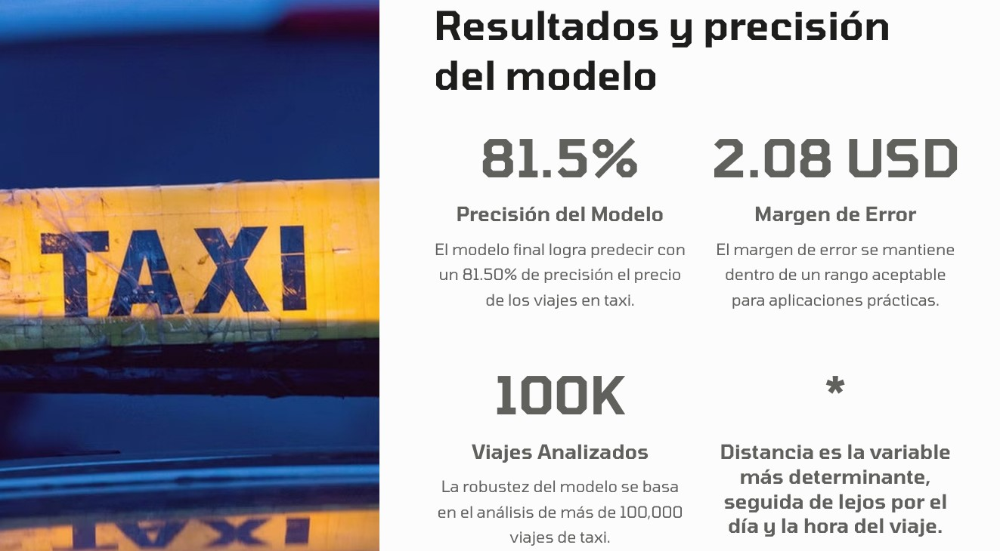

# 🚕🚕 Tarifa Taxi NY 🚕🚕 

🚂🚂 ¡Hola! Soy Gerardo Jiménez [LinkedIn](www.linkedin.com/in/gerardo-jimenez-islas), data analyst e ingeniero de minas y metalurgia.
Mi pasión por los datos y las tecnologías emergentes me ha llevado a comenzar este camino en el campo de machine learning e inteligencia artificial.

🚕🚕🚕🚕🚕🚕🚕
En este repositorio presento **Tarifa Taxi NY.**

El proyecto tiene como objetivo predecir el precio de los viajes en taxi en la ciudad de Nueva York, utilizando modelos de machine learning. 


**El proyecto se divide en dos notebooks principales:** uno para la limpieza y preparación de los datos, y otro para el análisis y predicción utilizando modelos de machine learning.

# 📂  Estructura del Proyecto

## 1. 🧹 Limpieza de Datos y feature engineering
El primer paso es limpiar y preparar los datos. Esto se realiza en el notebook limpieza_datos.ipynb. En este notebook se realizan las siguientes tareas:

📥 Carga del dataset desde Hugging Face.
❌ Eliminación de valores nulos.
🔽 Reducción del tamaño del dataset para agilizar el proceso.
➕ Creación de nuevas características a partir de las variables originales.
🌍 Transformación de variables cíclicas utilizando funciones trigonométricas.
💾 Guardado del dataframe final en un archivo CSV (data/df_final.csv).

## 2. 📊 Análisis y Predicción
El segundo paso es analizar y predecir los datos utilizando modelos de machine learning. Esto se realiza en el notebook ml.ipynb. En este notebook se realizan las siguientes tareas:

📥 Carga del dataframe final (data/df_final.csv).
🔄 División de los datos en conjuntos de entrenamiento y prueba.
🔽 Aplicación de PCA para reducir la dimensionalidad de las coordenadas de latitud y longitud.
⚖️ Estandarización de los datos.
🤖 Entrenamiento y evaluación de varios modelos de machine learning, incluyendo:
Random Forest
Gradient Boosting
XGBoost
🏆 Selección del modelo final basado en las métricas de rendimiento.
📊 Análisis de la importancia de las variables consideradas durante la predicción, por medio de la librería SHAP

**Código para aplicar el análisis de influencia de las variables en la predicción del precio:**


```python
import shap

# Inicializar la visualización interactiva de SHAP en Jupyter
shap.initjs()

# Usar KernelExplainer en lugar de TreeExplainer
explainer = shap.KernelExplainer(forest.predict, X_train_scaled)

# Calcular los valores SHAP para el conjunto de datos de prueba
shap_values = explainer.shap_values(X_test_scaled)
```



